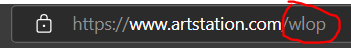

# Artstation Downloader
by **Bloom**

A simple script that downloads all art of an artist from [Artstation](https://www.artstation.com/).

## How to use

1. Run artstation_downloader.exe
2. Enter artist name

## How to build
1. `pip install pyinstaller`
2. `pyinstaller --onefile --icon=asset/app.ico artstation_downloader.py`
3. On `dist/` folder, you have your exe.